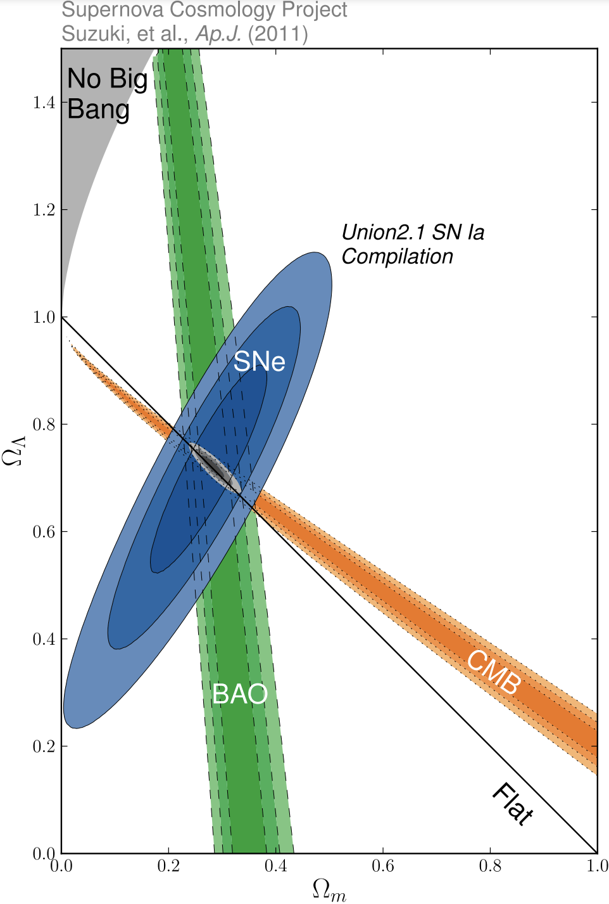
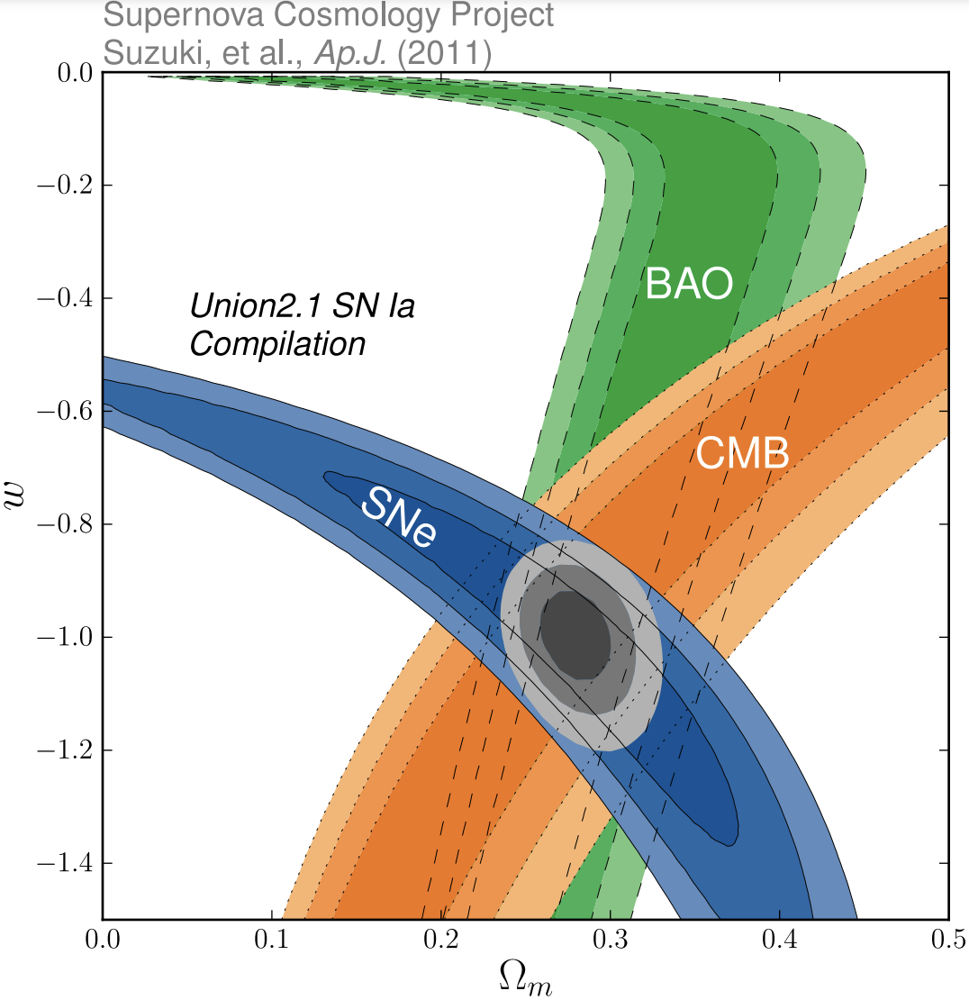

# Extragalactic Astronomy I Project  
**Constraining Cosmological Parameters Using SN and BAO Data**

This document provides the idea to carry out the project for the *Extragalactic Astronomy I* course of the IUCAA-NCRA graduate school (supervised by Prof. Surhud More). It is a step-by-step guide to constrain the cosmological parameters using Type Ia supernovae and Baryon Acoustic Oscillations (BAO). **Please work on the exercises individually**, as this project is designed to help you learn how to work with data to do science. You are required to use your own code (developed from previous assignments) to compute cosmological distances.

The class notes are available at:  
[https://surhudm.github.io/Cosmology_IUCAA_2025/](https://surhudm.github.io/Cosmology_IUCAA_2024/)

For any help, the TAs will be available for discussion. The latest version of this document is always available at:  
[https://github.com/PhysicistSouravDas/sn_bao_cosmology_2024](https://github.com/PhysicistSouravDas/sn_bao_cosmology_2024)

---

## Data

All the data required for the exercises can be found at:  
[https://github.com/PhysicistSouravDas/sn_bao_cosmology_2024](https://github.com/PhysicistSouravDas/sn_bao_cosmology_2024)

This project uses two datasets:

1. **Type Ia Supernova (SN) Data**  
   - **Dataset:** Joint Light-Curve Analysis (JLA) dataset ([Betoule et al., 2014](https://arxiv.org/abs/1401.4064))  
   - **Contents:** Data for 740 Type Ia SN including:
     - B band magnitude (`m_B`) vs. redshift (`z`) along with errors.
     - Covariance matrices (use the magnitude covariance matrix; the element $C_{i,j}$ represents the covariance between the $m_B$ measurements at the $i^{\text{th}}$ and $j^{\text{th}}$ redshifts).
   - **Files:**  
     - `data/JLA/jla_lcparams.txt` (light-curve parameters)  
     - `data/JLA/jla.dataset` (covariance matrix details)

2. **BAO Data**  
   - **Dataset:** First-year observations from the Dark Energy Spectroscopic Instrument (DESI) ([DESI Collaboration, 2024](https://arxiv.org/abs/2404.03002))  
   - **Contents:** BAO data at different redshifts including distance values and the type of distance quantity.
   - **Files:**  
     - `data/DESI2024/desi_2024_gaussian_bao_ALL_GCcomb_mean.txt`  
     - `data/DESI2024/desi_2024_gaussian_bao_ALL_GCcomb_cov.txt` (covariance matrix)

   The BAO data includes the following distance quantities:
   - **$D_M/r_s$:** The transverse comoving distance $D_M(z)$, normalized by the sound horizon radius $r_s$.
   - **$D_H/r_s$:** The Hubble distance $D_H(z)$, normalized by $r_s$.
   - **$D_V/r_s$:** The angle-averaged distance that quantifies the average of the distances measured along and perpendicular to the line of sight:
     
      $$D_V(z) = \left(z \, D_M(z)^2 \, D_H(z)\right)^{1/3}$$
      
      normalized by $r_s$.

   The angular diameter distance $D_A$ is related to $D_M$ by:
   
   $$D_M = (1+z)D_A$$
   
   Use this relation to compute $D_A$ from the provided $D_M$ values and their covariance matrix. (Note that the dataset does not include values for $r_s$, but it cancels out if you take ratios of $D_M/r_s$ at different redshifts).

**A guide to downloading files from GitHub:**

If you have Git installed in your system, you can enter the following command in your desired directory to download all the files

```bash
git clone https://github.com/PhysicistSouravDas/sn_bao_cosmology_2024.git
```

If you don't know what is going on, then it is highly recommended that you learn to use git at some point. You can start learning with a short playlist [here](https://www.youtube.com/playlist?list=PL-osiE80TeTuRUfjRe54Eea17-YfnOOAx).

You can also download all the files as zip by [clicking here](https://github.com/PhysicistSouravDas/sn_bao_cosmology_2024/archive/refs/heads/main.zip).

---

## Exercises

1. **Plot $m_B$ vs. $z$ with error bars on $m_B$.**

2. **Compute the distance modulus $\mu$:**

   The distance modulus is defined as

   $$\mu = m - M = 5\log_{10}{\left(D_L \text{ (in pc)}\right)} - 5$$
   
   where:
   - $m$ is the apparent magnitude.
   - $M$ is the absolute magnitude (which is not measured and must be treated as a parameter along with other cosmological parameters).
   - $D_L$ is the luminosity distance.

   **Likelihood Definition:**  
   Assume a Gaussian likelihood. Define the log likelihood function as:

   $$\chi^2 = \mathbf{r}^{\dagger} \, C^{-1} \, \mathbf{r}$$
   
   with:
   
   $$\mathbf{r} = y_{\text{obs}} - y_{\text{model}}$$
   
   Here, $C$ is the covariance matrix and the dagger ($\dagger$) denotes the transpose of the residual vector $\mathbf{r}$.

   **Priors and MCMC:**  
   - Define a log-prior function using uniform priors on:
     - $\Omega_{m}$ in the range $(0.0, 1.0)$
     - $\Omega_{\Lambda}$ in the range $(0.0, 1.0)$
     - $M$ (absolute magnitude; range can be chosen as appropriate)
   - Combine the log likelihood and log prior to define the log posterior (or log probability) for running the MCMC.
   - It is recommended to use the [emcee](https://emcee.readthedocs.io/en/stable/tutorials/line/) Python3 package for the MCMC analysis.
   - You may quote the values of $\Omega_m$, $\Omega_{\Lambda}$, and $M$ by maximizing the log probability before running the MCMC.

   **Plots:**  
   - Plot $\mu$ vs. $z$ along with the errors on $\mu$.
   - Convert $\mu$ to $D_L$ and plot $D_L$ vs. $z$ with the errors on $D_L$.

3. **ΛCDM Predictions:**  
   Plot $\mu$ vs. $z$ for three different sets of $\Omega$ parameters (using a Hubble parameter $h = 0.703$):
   
   - $\Omega_{m} = 0.05$, $\Omega_{\Lambda} = 0.4$
   - $\Omega_{m} = 0.2$, $\Omega_{\Lambda} = 0.6$
   - $\Omega_{m} = 0.4$, $\Omega_{\Lambda} = 0.9$
   
   Compute the $\chi^2$ values for each model and discuss your interpretation of the results.

4. **Contour Plot for SN Data:**  
   Generate a contour plot (showing $1\sigma$ and $2\sigma$ confidence levels) for the SN data.  
   It is recommended to use the [corner](https://corner.readthedocs.io/en/latest/) Python3 package.

   **Example:**  
   <div style="text-align: center">
      <br>
   <strong>Figure 1:</strong> Contours from different datasets to constrain cosmological parameters assuming ΛCDM model.
   </div>

5. **BAO Analysis:**  
   - Plot $D_A$ vs. $z$ and propagate the errors. (You can compute the errors on $D_M$ from the diagonal elements of the covariance matrix since the off-diagonal elements are very small.)
   - Estimate the cosmological parameters from the BAO data using a Gaussian likelihood.
   - Create a corner plot for the BAO data as shown in Figure 1.
   - Report the constrained cosmological parameter values.

6. **Combined SN and BAO Analysis:**  
   Combine both the SN and BAO observations to further constrain the cosmological parameters, as illustrated in Figure 1.

7. **Bonus Exercise:**  
   Extend the analysis to the $w$CDM model and generate contour plots as shown in Figure 2. This part is not compulsory but will be considered as a bonus exercise.

   **Example:**  
   <div style="text-align: center">
   <br>
   </div>
   <strong>Figure 2:</strong> Contours from different datasets to constrain the cosmological parameters under the wCDM model.

---

## References

- [**Betoule, M. et al. (2014):**](https://arxiv.org/abs/1401.4064)<br> 
  *"Improved cosmological constraints from a joint analysis of the SDSS-II and SNLS supernova samples"*.  

- [**DESI Collaboration (2024):**](https://arxiv.org/abs/2404.03002)  <br>
  *DESI 2024 VI: Cosmological Constraints from the Measurements of Baryon Acoustic Oscillations.*.  

---


